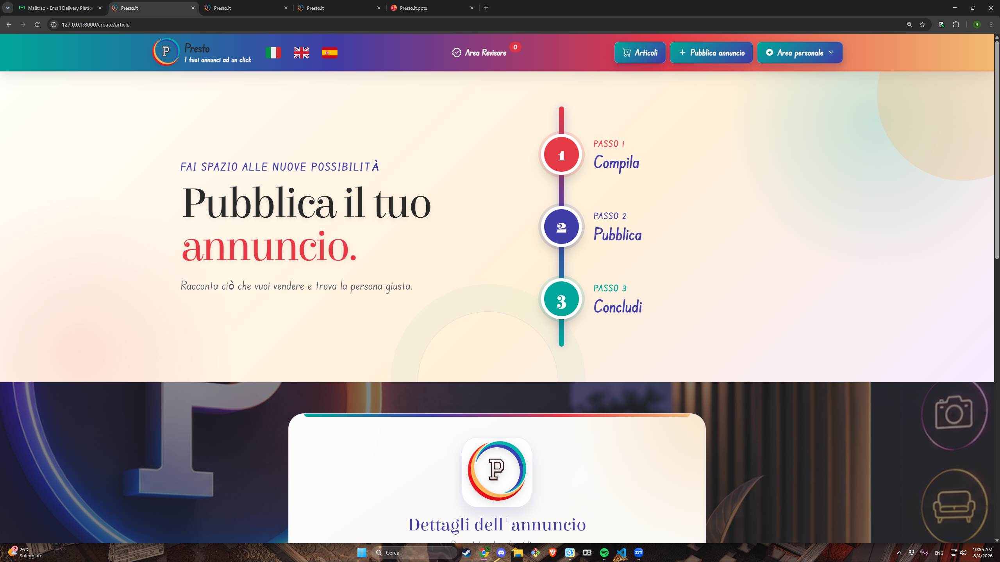
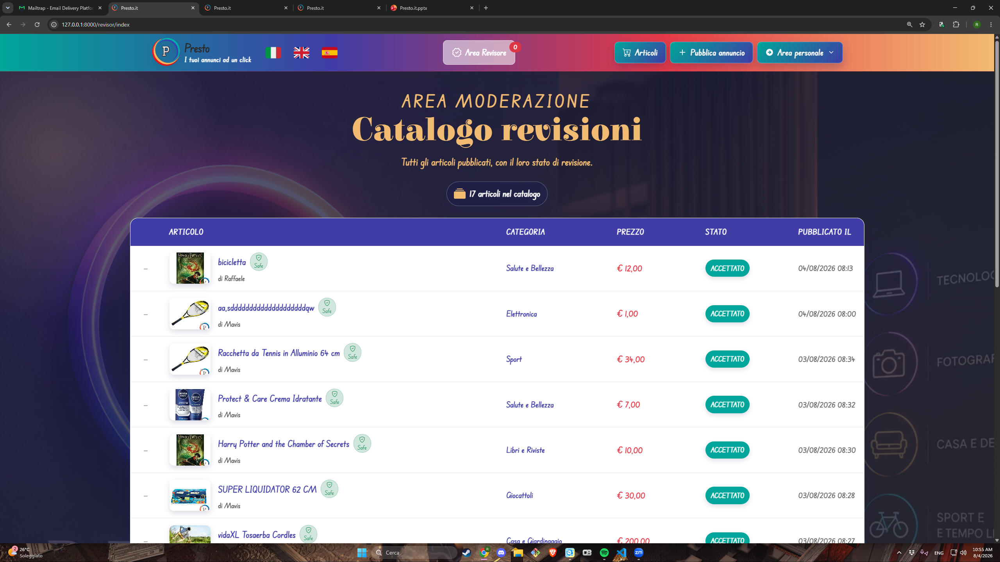

# Presto.it

Full-stack web application developed as the final project of the Aulab Hackademy course.

## About the Project

Presto.it is a multilingual online marketplace that allows users to browse, publish and manage classified listings.

The application was developed with Laravel and Livewire and includes user authentication, Google OAuth login, password recovery, multilingual support and a moderation system for published listings.

Users can create listings by uploading up to 10 images. Uploaded images are processed through asynchronous Laravel Jobs and analyzed using Google Cloud Vision to detect potentially inappropriate content and faces before publication.

The platform also includes a dedicated reviewer area where authorized users can review submitted listings and decide whether they can be published.

## Features

- User registration and authentication
- Login with Google
- Password recovery
- Multilingual interface
  - Italian
  - English
  - Spanish
- Classified listings catalog
- Listing creation, editing and deletion
- Multiple image upload
- Up to 10 images per listing
- Image validation
- Image moderation using Google Cloud Vision
- SafeSearch analysis
- Face detection and removal
- Image watermarking
- Automatic thumbnail generation
- Reviewer role and moderation area
- Listing approval and rejection
- Email notifications
- Category management
- User-specific listing management
- Responsive interface
- Asynchronous image processing using Laravel Jobs

## Technologies

- PHP
- Laravel
- Livewire
- MySQL
- Eloquent ORM
- Blade
- Bootstrap
- HTML5
- CSS3
- JavaScript
- Vite
- Google Cloud Vision
- Google OAuth
- Laravel Jobs & Queues
- SMTP / Mailtrap

## Image Processing

One of the main features of the application is the automated processing of uploaded images.

Images uploaded by users are processed through a series of Laravel Jobs:

1. Image analysis
2. Google Vision SafeSearch verification
3. Face detection and removal
4. Watermark generation
5. Thumbnail generation

This architecture allows image processing tasks to be handled asynchronously instead of blocking the main application request.

## Authentication

The application provides multiple authentication features, including:

- Standard user registration and login
- Google OAuth authentication
- Password recovery

Authentication and authorization are also used to control access to user-specific functionality and the reviewer area.

## Moderation System

Published listings are subject to a moderation workflow.

Authorized reviewers can access a dedicated moderation area where they can inspect listings and determine whether they can be published.

The application combines manual review with automated image analysis to help identify potentially inappropriate content.

## Database

The application uses a MySQL relational database managed through Laravel migrations and Eloquent ORM.

The database handles relationships between users, listings, categories and other application entities.

## Screenshots

### Homepage


### Registration and Google Login


### Listings Catalog


### Publish a Listing



### Reviewer Area



## Project Structure

```text
Presto.it/

├── app/
│   ├── Http/
│   ├── Jobs/
│   ├── Livewire/
│   ├── Models/
│   └── ...
│
├── database/
│   ├── factories/
│   ├── migrations/
│   └── seeders/
│
├── public/
├── resources/
│   ├── css/
│   ├── js/
│   ├── lang/
│   └── views/
│
├── routes/
├── storage/
├── tests/
├── screenshots/
├── .env.example
├── composer.json
├── package.json
└── vite.config.js

## Team

Developed as a team during the Aulab Hackademy course.

- Raffaele Guacci — [GitHub](https://github.com/RGuacci)
- Manuel Pierangeli — [GitHub](https://github.com/ManuelPierangeli)
-Daniele Pigliacelli  — [GitHub](https://github.com/idaneu2-boop)
-Adamo Junior Mizzoni  — [GitHub](https://github.com/adamojr-boop)